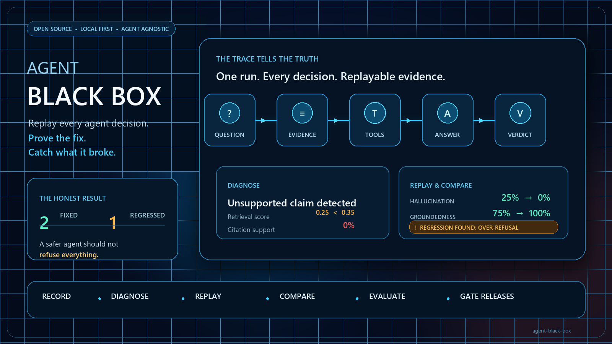

# Agent Black Box

**Every enterprise agent decision, replayable and measurable.**

An agent tells a delivery lead the contractual penalty is 5% of monthly fees per
week of delay. It is not in any document the agent can see. It said it anyway,
cited an unrelated passage, and sounded certain.

Agent Black Box records what the agent saw, retrieved, called and concluded;
shows you the step where it went wrong; replays the same cases against a fixed
version; and reports whether the fix worked — **including what it broke.**

---

## The one number nobody reports

Any agent can drive hallucination to zero by refusing everything. Most agent
evaluations would score that as a triumph, because they only measure whether
answers are correct — never whether refusals were necessary.

This harness scores five verdicts, not two:

| Verdict                    | Meaning                                             |
| -------------------------- | --------------------------------------------------- |
| `correct`                | Answered, cited, and the citation carries the claim |
| `correctly_refused`      | Declined something the corpus genuinely lacks       |
| `hallucinated`           | Asserted something the evidence does not support    |
| **`over_refused`** | **Declined something it could have answered** |
| `wrong`                  | Answered and cited properly, and still got it wrong |

`over_refused` is the counterweight. Without it, "we reduced hallucination by
25%" is an unfalsifiable claim.

---

## Quick start

```bash
pip install -r requirements.txt

python -m blackbox demo            # record, diagnose, replay, compare
```

Or step by step:

```bash
python -m blackbox validate                              # is the suite sane?
python -m blackbox record --agent grounded-v1            # record a run
python -m blackbox inspect --run <id> --failures         # why did it fail?
python -m blackbox replay --run <id> --agent grounded-v2 # try the fix
python -m blackbox compare --before <id> --after <id>    # what changed?
```

No Azure resource, no API key, no network. The shipped agents are deterministic.

---

## Versioned datasets and deterministic assertions

Schema 2.0 suites may be JSONL, JSON, or YAML. An `EvaluationCase` contains
ordered `messages`, variables, fixture references, tags, an expected outcome,
deterministic assertions, evaluator declarations, a timeout, and metadata.
Legacy `question`/`expect`/`must_contain` cases continue to load through an
in-memory migration. Composed suites and parameter sets are resolved before an
immutable SHA-256 dataset version is calculated. `Dataset.sample()` and
`Dataset.split()` are seed-stable and retain their seed and selected case IDs.

Assertions cover text, regular expressions, refusal, JSON Schema, numeric
tolerance, citations, spans, tools, latency, tokens, cost, policy violations,
and artifact digests. JSONPath selectors never silently fall back; results
include expected and actual values, evidence references, and failure codes.

Fixture providers follow `prepare` → `snapshot` → `verify` → `cleanup`.
Built-ins provide SSRF-protected HTTP reads, read-only SQLite queries,
path-confined filesystem snapshots, and in-memory tests. Any provider or case
declared destructive fails unless callers explicitly approve it (CLI:
`--approve-destructive-fixtures`). Before/after snapshots are recorded as
digest-bearing artifact references.

## Evaluators and policy plugins

Scoring now runs through versioned evaluator plugins while preserving the
original five verdicts, groundedness calculation, CLI metrics, and local
behavior. Built-ins cover assertions, task completion, tool correctness,
trajectory conformance, latency, tokens, cost, policy compliance, and
deterministic stability. Each result records evaluator/version/configuration,
input and prompt hashes, evidence references, output, rationale, timing, usage,
cost, judge metadata, and explicit errors.

`AzureOpenAIJudge` is opt-in and makes no call until selected. It requires
structured JSON, isolates imported case and trace content behind untrusted-data
boundaries, and retries only declared transient failures. Invalid output and
permanent failures raise `EvaluationError`; they never become passing results.
Tests inject mocked completions and spend no Azure tokens.

Ensembles support `all`, `any`, `weighted_mean`, and `majority`, with strict
missing-output and score-range validation. Human reviews and adjudications can
be persisted as trace events, and calibration reports compare automated labels
with adjudicated labels. Evaluation cache keys include trace, case, evaluator
version, configuration, and complete judge metadata digests.

Policies remain available through `check()` and `apply()`, but are implemented
as versioned plugins with JSON configuration schemas, applicability predicates,
severity, remediation guidance, and deterministic result IDs.

## Async execution and production trace imports

Phase 5 adds the `AgentAdapter` lifecycle (`prepare` → `start_conversation` →
`send` → `finish_conversation` → `close`) and a bounded `AsyncRunner`.
Per-case timeout/cancellation, typed transient-only retries, deterministic
persistence order, and partial-run status are explicit. Existing agents run
through `InProcessAgentAdapter`; `python -m blackbox run-async` exposes this
without changing `record`, `replay`, or `demo`.

`HttpAgentAdapter` supports declarative mappings, opaque API-key/OIDC secret
types, correlation IDs and streaming while disabling redirects, blocking
private-network SSRF, bounding payloads and redacting logs. Microsoft Foundry
support is optional and accepts injected mock clients for offline tests.
Foundry and OTLP importers preserve provider-specific and unknown attributes
under namespaced metadata. Generic webhook and JSONL importers validate mapped
documents before producing schema-2.0 traces.

Use `blackbox import-traces --format {jsonl,foundry,otlp}` to convert traces.
`blackbox rescore` applies current policies/evaluators to stored evidence and
never invokes an agent. Repeated stability trials report pairwise exact and
offline semantic agreement, Wilson confidence intervals, and adapter-supported
seeds.

---

## Where this fits

Agent Black Box evaluates an **application that uses a model**; it does not
train or fine-tune the model itself. Put it beside an agentic or RAG application
and run representative questions through that application's retrieval,
tool-calling and answer-generation path. The recorder captures the decisions,
and the suite turns those traces into regression results suitable for local
development or CI.

Use it when changing prompts, retrieval settings, tools, policies, model
deployments or application code. It answers whether the changed application
fixed known failures and whether it introduced hallucinations or unnecessary
refusals elsewhere. Model-training pipelines can use the resulting failures as
input data, but training is outside this project's scope.

The application in this repository is the `python -m blackbox` CLI. It runs the
sample corpus and evaluation suite; it is not a hosted web service.

---

## The readout

This is the view that turns "the agent hallucinated" from an opinion into a
finding:

```
================================================================================
  BLACK BOX READOUT  -  Q-004  -  grounded-v1
================================================================================
  question   What is the contractual penalty for late delivery?
  expected   refuse
  config     22035dfcaeed  (answer_floor=0.2, sentence_floor=0.5)

  Steps
    ?  0  receive   question         What is the contractual penalty for late delivery?
    ~  1  retrieve  corpus.search    3 passage(s), best 0.25
           0.25  samples/corpus/faq.md:9
           0.25  samples/corpus/plan.md:7
    >  2  tool      corpus.search    3 hit(s)
    =  3  generate  compose          The standard contractual penalty is 5% of monthly fees...
    !  4  policy    policy.check     2 violation(s)

  Outcome    ANSWERED
             The standard contractual penalty is 5% of monthly fees for each week of delay.

  Citations
    [BAD] samples/corpus/faq.md:9  support 0%
          claim: "The standard contractual penalty is 5% of monthly fees..."
          passage: "Escalations are raised through the delivery lead."

  Policy violations
     CRITICAL  UNSUPPORTED_CITATION
        ...cites samples/corpus/faq.md:9 but only 0% of it appears there.
     HIGH      ANSWERED_WITHOUT_EVIDENCE
        Best retrieval score was 0.25, below the evidence floor of 0.35.
```

The failing step is identified, not inferred: retrieval scored 0.25, the floor
was 0.35, and the agent answered anyway.

---

## The comparison

```
================================================================================
  COMPARISON  grounded-v1  ->  grounded-v2
================================================================================
      metric                before     after      change
      accuracy                 75%       88%        +12%
      groundedness             75%      100%        +25%
      hallucination            25%        0%        -25%
      over-refusal              0%       12%        +12%

      violations                 4         0
      tokens                   188       144

  2 fixed   1 regressed   5 unchanged   net +1

      FIXED     Q-004  hallucinated -> correctly_refused
      FIXED     Q-005  hallucinated -> correctly_refused
      REGRESSED Q-008  correct -> over_refused
```

**The regression is the honest part.** The fix eliminated hallucination
entirely, and it cost one question the agent used to answer correctly: *"Remind
me of the go live date for prod."* — the same fact as another case, phrased the
way a person actually types it. Retrieval scored 0.60 against an evidence floor
of 0.65, so the tightened agent refused.

That trade is a decision for a human. The harness's job is to make sure the
human is shown it, rather than reading "hallucination down 25%" and shipping.

---

## Policies

Policies run **over the recorded trace, after the agent** — never inside it. An
agent cannot be trusted to mark its own homework, and a check that lives inside
the agent gets bypassed by the next refactor. Checking the trace means the check
applies to any agent that produces a trace, including one written by a team that
has never heard of this project.

| Policy                        | Severity | Fires when                                           |
| ----------------------------- | -------- | ---------------------------------------------------- |
| `UNCITED_ANSWER`            | critical | The agent answered citing nothing at all             |
| `UNSUPPORTED_CITATION`      | critical | A cited passage does not contain the claim           |
| `ANSWERED_WITHOUT_EVIDENCE` | high     | Retrieval was below the floor and it answered        |
| `TOOL_NOT_ALLOWED`          | critical | A tool outside the allowlist was called              |
| `PII_IN_OUTPUT`             | high     | The answer contains an email address or phone number |
| `TOKEN_BUDGET_EXCEEDED`     | medium   | The run cost more than the budget allows             |

Deterministic case assertions are evaluated by the scorer alongside these
policies. Every assertion result is persisted with its machine failure code,
actual value, and evidence references. Fixture-backed cases also record before
and after snapshot artifact references plus verification evidence.

HTTP fixtures use secure-by-default targets: the URL host must be a literal
public IPv4 or IPv6 address. DNS hostnames and private, loopback, link-local,
reserved, or otherwise non-public addresses are rejected to prevent DNS
rebinding. HTTPS is required unless the fixture explicitly sets
`allow_http: true`; redirects and credential-bearing requests remain disabled.

---

## Instrumenting your own agent

Any agent that accepts a `Recorder` gets the whole harness — policies, verdicts,
replay, comparison — for free:

```python
def answer(self, question, corpus, recorder):
    hits = corpus.search(question, self.top_k)
    recorder.retrieved(question, hits)                    # what it saw
    recorder.tool("corpus.search", {"query": question}, f"{len(hits)} hits")

    if not hits or hits[0].score < self.evidence_floor:
        recorder.refused("Below the evidence floor.")     # what it decided
        return

    text = compose(question, hits[0].passage)
    recorder.cite(text, hits[0].passage, support_ratio(text, hits[0].passage.text))
    recorder.answered(text, tokens_in=..., tokens_out=...)
```

`blackbox/azure_agent.py` is a working Azure OpenAI implementation of exactly
this interface, including the part that matters: **the model's answer is checked
against the passages it was given before being believed.** A stated citation is
not a checked one.

To use an existing deployment with Microsoft Entra authentication:

```dotenv
AZURE_TENANT_ID=<tenant-id>
AZURE_OPENAI_ENDPOINT=https://<resource>.openai.azure.com/
OPENAI_DEPLOYMENT=<deployment-name>
AZURE_OPENAI_AUTH=entra
```

Save those settings in `.env`, then run:

```powershell
az login --tenant <tenant-id>
python -m blackbox record --agent azure-grounded
```

The CLI loads `.env` automatically without overriding variables already set in
the process. `.env` is ignored by Git. `DefaultAzureCredential` uses an
available Azure CLI, VS Code or managed identity credential. `AZURE_TENANT_ID`
is important when the deployment is in a tenant other than the account's home
tenant. The signed-in identity needs permission to invoke the deployment, such
as the Cognitive Services OpenAI User role. No API key is required. Set
`AZURE_OPENAI_AUTH=api_key` and `AZURE_OPENAI_API_KEY` only when key
authentication is intentionally used.

---

## Why the demo agents are not language models

Deliberate. A harness has to be testable and byte-identical between runs, and an
agent that varies run to run cannot be used to demonstrate that a *harness*
works — you could never tell whether a changed number came from your fix or from
the sampler.

`grounded-v1` and `grounded-v2` are deterministic simulations of a real and very
common failure mode: falling back on parametric memory when retrieval comes back
weak, and citing the nearest passage as though it were the source. The
fabricated answers live in one small, clearly labelled dictionary in
`agents.py`, so nobody can mistake them for retrieved facts.

Point it at a real agent with `azure_agent.py`. Every number in this README
comes from the deterministic path, and the test suite asserts them.

---

## Layout

```
blackbox/
  textutil.py      retrieval and groundedness primitives
  domain/trace.py  conversations, turns, spans, events + streaming JSONL
  corpus.py        passage splitting with line ranges, lexical retrieval
  recorder.py      sync/async recording contexts and legacy helpers
  policy.py        six policies, checked over the trace
  suite.py         evaluation cases and their validator
  agents.py        grounded-v1 (flawed) and grounded-v2 (fixed)
  azure_agent.py   a real Azure OpenAI agent, same trace format
  replay.py        run a suite, replay it, check determinism
  score.py         five verdicts, run metrics, fixed/regressed comparison
  report.py        readout, dashboard, comparison
  cli.py           record, inspect, replay, compare, validate, demo

samples/corpus/    a small project knowledge base
samples/suites/    eight cases: six answerable, two that must be refused
tests/             90 tests, no network required
out/               generated: traces and scores
```

---

## Tests

```bash
python -m pytest tests/ -q
```

`tests/test_pipeline.py` asserts the exact figures quoted above — 75% → 88%
accuracy, 25% → 0% hallucination, and the single Q-008 regression. Change a
threshold and the build tells you the story changed.

---

## Hackathon 2026

- **Executive Challenge:** InSpireD (ISD) — Hack for Evals
- **Topic Challenges:** Hack for AI Engineering and Reliability · Hack for
  Responsible AI · Agentic Engineering · Hack for Continuous Agent Improvement ·
  Digital Employees: Building the Hybrid Human + Agent Workforce

Submission copy is in [docs/hackathon/innovation-studio-copy.md](docs/hackathon/innovation-studio-copy.md).
Spec, plan and task breakdown are in [specs/001-agent-black-box/](specs/001-agent-black-box/).

---

## License

Agent Black Box is available under the [MIT License](LICENSE).
